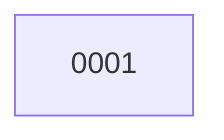

# Backlog

**1 changes** — 🟡 1 proposed

## 🟡 Proposed (1)

| # | Title | Priority | Type | Readiness |
|---|-------|----------|------|-----------|
| [0001](active/0001-correct-v0-1-contract-consistency.md) | Correct v0.1 authority and event contract consistency | `high` | `fix` | build-ready |

