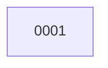

# Backlog

**1 changes** — 🔵 1 implemented

## 🔵 Implemented — awaiting merge (1)

| # | Title | Priority | Type | PR | Readiness |
|---|-------|----------|------|----|-----------|
| [0001](active/0001-correct-v0-1-contract-consistency.md) | Correct v0.1 authority and event contract consistency | `high` | `fix` | [#1](https://github.com/ethanhinson/adp/pull/1) |  |

